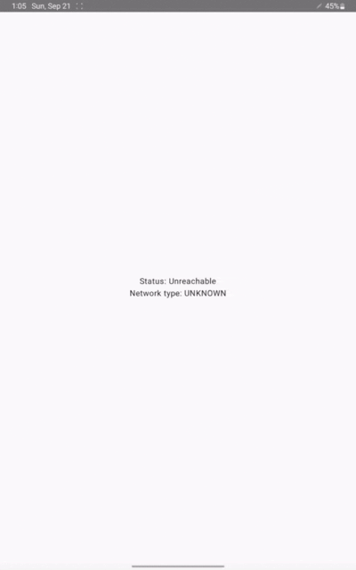
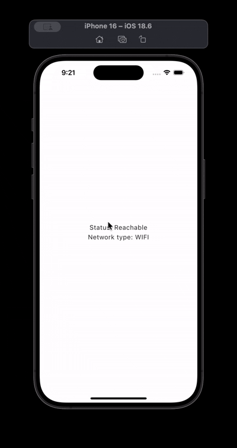
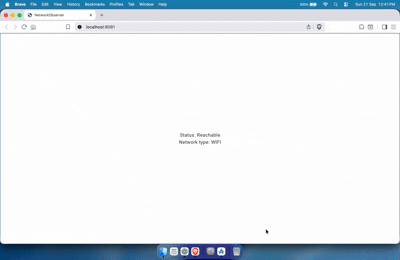
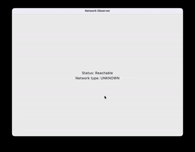

# 🌐 NetworkObserver

[](https://central.sonatype.com/artifact/com.tarifchakder/networkobserver)
[](LICENSE)
[](https://kotlinlang.org)
[](https://github.com/JetBrains/compose-multiplatform)


---

## ✨ Overview

NetworkObserver is a lightweight Kotlin Multiplatform (KMP) library for Compose Multiplatform. It provides a simple, unified API to monitor network connectivity across Android, iOS, Desktop (JVM), and Web/Wasm, with real-time updates and platform-specific insights.

---

## 🧰 Tech stack
- Language: Kotlin Multiplatform (Kotlin 2.0.20)
- UI: Compose Multiplatform (1.7.0)
- Build system: Gradle 8.13 (with Gradle Wrapper)
- Plugins: Kotlin Multiplatform, Android Library/Application, Compose Multiplatform, Maven Publish
- Targets:
  - Android (minSdk 24, target/compileSdk 36)
  - iOS (iosX64, iosArm64, iosSimulatorArm64)
  - JVM (Desktop)
  - Wasm/JS (browser)
- Publishing: com.vanniktech.maven.publish to Maven Central (via GitHub Actions)

---

## 🖥️ Demo

|              Android              |            iOS             |            Web             |              Desktop               |
|:---------------------------------:|:--------------------------:|:--------------------------:|:----------------------------------:|
|  |  |  |  |

## 📦 Features
- Cross-platform: Android, iOS, Desktop, Web/Wasm
- Real-time network updates
- Network type detection: WiFi, Cellular, Ethernet, Unknown
- Composable-friendly API

---

## 📁 Project structure
- network — KMP library module (Android, iOS, JVM, Wasm/JS)
  - commonMain: shared API (NetworkObserver, NetworkStatus, NetworkType, Ext.kt)
  - androidMain, iosMain, jvmMain, wasmJsMain: platform implementations
- sample — KMP sample UI demonstrating usage
  - Android entry: sample/src/androidMain/.../MainActivity.kt
  - JVM entry: sample/src/jvmMain/kotlin/com/tarifchakder/sample/main.kt
  - iOS UI host: sample/src/iosMain/kotlin/com/tarifchakder/sample/MainViewController.kt
  - Web/Wasm entry: sample/src/wasmJsMain/kotlin/com/tarifchakder/sample/main.kt
- iosApp — Native SwiftUI host app that embeds the sample for iOS (open with Xcode)

---

## ✅ Requirements
- JDK 17+
- Android Studio (to run Android sample)
- Xcode 15+ (to run iOS app)
- macOS for iOS builds (CI uses macos-latest)
- Gradle (via ./gradlew wrapper)

Note: For Web/Wasm, Gradle will manage the toolchain; no manual Node setup is typically required.

---

## 🚀 Installation (as a dependency)
Add NetworkObserver to your multiplatform project by depending on it from commonMain.

### Gradle (Kotlin DSL)
```kotlin
kotlin {
    sourceSets {
        commonMain {
            dependencies {
                implementation("com.tarifchakder:networkobserver:<latest-version>")
            }
        }
    }
}
```

### Version Catalog
```toml
[versions]
networkObserver = "1.0.6" # use latest version

[libraries]
network-observer = { module = "com.tarifchakder:networkobserver", version.ref = "networkObserver" }
```

---

## 🧪 Usage (Compose)
```kotlin
MaterialTheme {
    Column(
        modifier = Modifier.fillMaxSize(),
        verticalArrangement = Arrangement.Center
    ) {
        val status by networkObserverAsState()
        Text("Status: $status")

        val networkType by networkTypeAsState()
        Text("Network type: $networkType")
    }
}
```

Key APIs are defined in commonMain (e.g., Ext.kt and NetworkObserver.kt) and backed by platform-specific implementations.

---

## ▶️ Build & Run the samples
Use the Gradle Wrapper from the repository root.

- Build everything:
  - ./gradlew build

- Android (sample):
  - Assemble: ./gradlew :sample:assembleDebug
  - Install on device/emulator: ./gradlew :sample:installDebug
  - Or open the project in Android Studio and Run the sample configuration.

- Desktop (JVM):
  - Run: ./gradlew :sample:run

- Web/Wasm:
  - Dev server (auto-reload): ./gradlew :sample:wasmJsBrowserDevelopmentRun
  - Production build: ./gradlew :sample:wasmJsBrowserProductionWebpack or :sample:wasmJsBrowserDistribution

- iOS:
  - Open iosApp/iosApp.xcodeproj in Xcode and run the iOSApp scheme on a simulator or device.
  - The KMP sample UI is bridged via MainViewController in sample/src/iosMain.

---

## 🧩 Useful Gradle tasks (scripts)
- :network:publishToMavenLocal – Publish the library locally for testing
- :network:assembleRelease – Build release AAR/artifacts for Android
- :sample:run – Run Desktop sample
- :sample:assembleDebug / :sample:installDebug – Android sample tasks
- :sample:wasmJsBrowserDevelopmentRun – Serve Web sample

See also the GitHub Action for releases: .github/workflows/release.yml

---

## 🧪 Tests
- No tests are present in this repository at the moment. TODO: Add unit tests for common logic and platform stubs.

---

## 📦 Entry points (for reference)
- Library API: network/src/commonMain/kotlin/com/tarifchakder/networkobserver/
  - NetworkObserver.kt, Ext.kt, NetworkStatus.kt, NetworkType.kt
- Android sample: sample/src/androidMain/kotlin/com/tarifchakder/sample/MainActivity.kt
- Desktop sample: sample/src/jvmMain/kotlin/com/tarifchakder/sample/main.kt
- iOS sample host: sample/src/iosMain/kotlin/com/tarifchakder/sample/MainViewController.kt
- Web/Wasm sample: sample/src/wasmJsMain/kotlin/com/tarifchakder/sample/main.kt
- Native iOS app host: iosApp/iosApp.xcodeproj (iOSApp.swift)

---

## 🤝 Contributing
Issues and PRs are welcome! If you’d like to add features or fix bugs, please open an issue first so we can discuss scope and approach.

---

## 📄 License
This project is distributed under the MIT License. See LICENSE for details.


